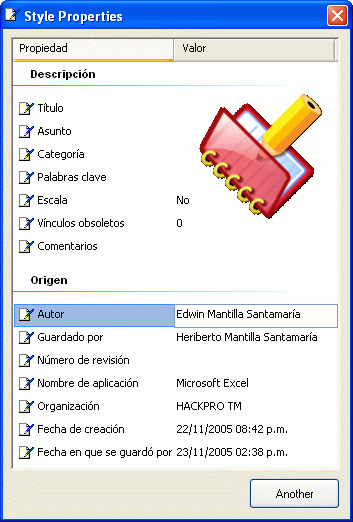



## SMGrid 1\.1

### Description

The new of the Control:

- Support Text Unicode.

- MouseWheel.

- Movement and selection of individual cells.

- Scrollbar's with Subclassing

- Edition of one &#243; several cells.

- You can add background, icons.

Any commentary is welcome.

The control isn't totally finished but it's a good advance,

Plz see the screenshot.

Its development this stopped indefinitely, is Christmas.

----

Lo Nuevo del Control:

- Soporta Texto Unicode.

- Mouse Wheel.

- Movimiento y selecci&#243;n de celdas individuales.

- Scrollbar's mediante el uso de la subclase.

- Edici&#243;n de una &#243; varias celdas.

- Agregar fondo, iconos.

Cualquier comentario es bienvenido.

El control no est&#225; totalmente terminado pero es un buen avance.

Por favor miren el screenshot.

Su desarrollo esta detenido indefinidamente, estoy festejando la navidad.
 
### More Info
 

             |
---                |---
**Submitted On**   |2006-05-02 23:51:02
**By**             |[Heriberto Mantilla Santamaria](https://github.com/Planet-Source-Code/PSCIndex/blob/master/ByAuthor/heriberto-mantilla-santamaria.md)
**Level**          |Intermediate
**User Rating**    |5.0 (55 globes from 11 users)
**Compatibility**  |VB 5\.0, VB 6\.0
**Category**       |[Custom Controls/ Forms/  Menus](https://github.com/Planet-Source-Code/PSCIndex/blob/master/ByCategory/custom-controls-forms-menus__1-4.md)
**World**          |[Visual Basic](https://github.com/Planet-Source-Code/PSCIndex/blob/master/ByWorld/visual-basic.md)
**Archive File**   |[SMGrid\_1\_1199170532006\.zip](https://github.com/Planet-Source-Code/heriberto-mantilla-santamaria-smgrid-1-1__1-63532/archive/master.zip)

